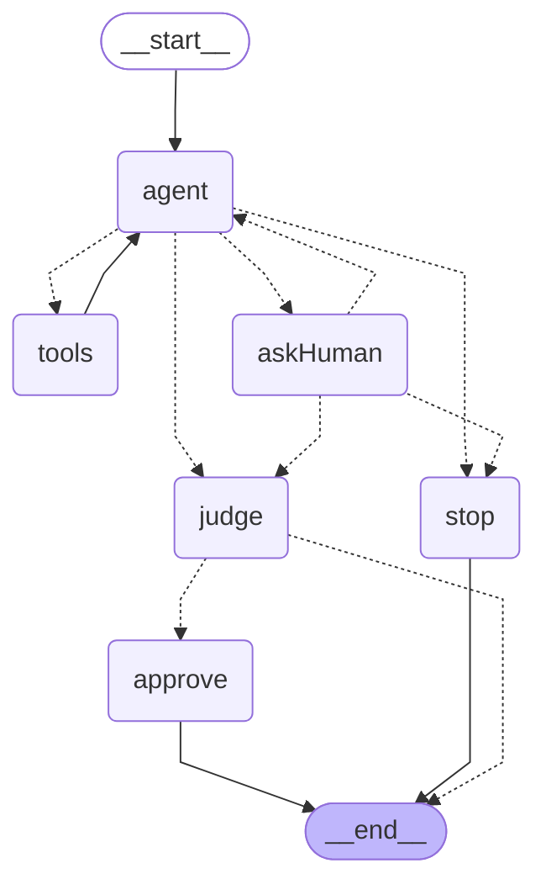

# 내 에이전트 — 보고 → agent ⇄ tools → judge

```mermaid
%%{init: {'flowchart': {'curve': 'linear'}}}%%
graph TD;
	__start__([<p>__start__</p>]):::first
	agent(agent)
	tools(tools)
	askHuman(askHuman)
	judge(judge)
	approve(approve)
	stop(stop)
	__end__([<p>__end__</p>]):::last
	__start__ --> agent;
	approve --> __end__;
	stop --> __end__;
	tools --> agent;
	agent -.-> tools;
	agent -.-> judge;
	agent -.-> stop;
	agent -.-> askHuman;
	askHuman -.-> agent;
	askHuman -.-> judge;
	askHuman -.-> stop;
	judge -.-> approve;
	judge -.-> __end__;
	classDef default fill:#f2f0ff,line-height:1.2;
	classDef first fill-opacity:0;
	classDef last fill:#bfb6fc;

```
