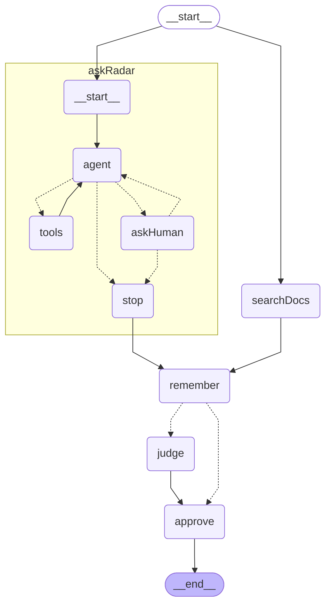

# 내 에이전트 — 보고 → [규정집 Worker ‖ 레이더 Subagent] → remember → judge → approve

```mermaid
%%{init: {'flowchart': {'curve': 'linear'}}}%%
graph TD;
	__start__([<p>__start__</p>]):::first
	searchDocs(searchDocs)
	askRadar___start__(<p>__start__</p>)
	askRadar_agent(agent)
	askRadar_tools(tools)
	askRadar_askHuman(askHuman)
	askRadar_stop(stop)
	remember(remember)
	judge(judge)
	approve(approve)
	__end__([<p>__end__</p>]):::last
	__start__ --> searchDocs;
	__start__ --> askRadar___start__;
	approve --> __end__;
	askRadar_stop --> remember;
	judge --> approve;
	searchDocs --> remember;
	remember -.-> judge;
	remember -.-> approve;
	subgraph askRadar
	askRadar___start__ --> askRadar_agent;
	askRadar_tools --> askRadar_agent;
	askRadar_agent -.-> askRadar_tools;
	askRadar_agent -.-> askRadar_stop;
	askRadar_agent -.-> askRadar_askHuman;
	askRadar_askHuman -.-> askRadar_agent;
	askRadar_askHuman -.-> askRadar_stop;
	end
	classDef default fill:#f2f0ff,line-height:1.2;
	classDef first fill-opacity:0;
	classDef last fill:#bfb6fc;

```
