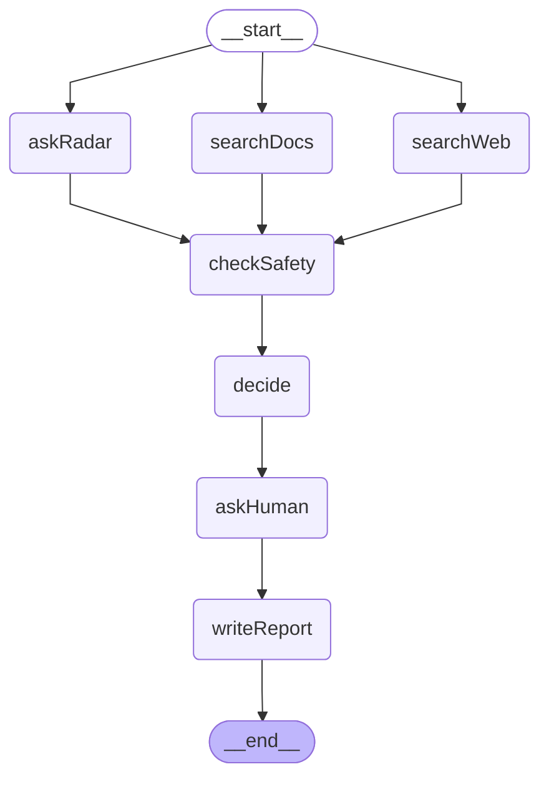

# 실습 2 — 스크램블 판단 보조

```mermaid
%%{init: {'flowchart': {'curve': 'linear'}}}%%
graph TD;
	__start__([<p>__start__</p>]):::first
	searchDocs(searchDocs)
	searchWeb(searchWeb)
	askRadar(askRadar)
	checkSafety(checkSafety)
	decide(decide)
	askHuman(askHuman)
	writeReport(writeReport)
	__end__([<p>__end__</p>]):::last
	__start__ --> searchDocs;
	__start__ --> searchWeb;
	__start__ --> askRadar;
	askHuman --> writeReport;
	askRadar --> checkSafety;
	checkSafety --> decide;
	decide --> askHuman;
	searchDocs --> checkSafety;
	searchWeb --> checkSafety;
	writeReport --> __end__;
	classDef default fill:#f2f0ff,line-height:1.2;
	classDef first fill-opacity:0;
	classDef last fill:#bfb6fc;

```
