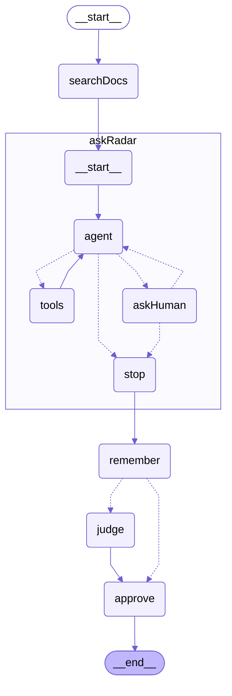

# 단계 5: 5번을 풀 차례 — 1 ~ 4 정답 (pnpm step 5)

```mermaid
%%{init: {'theme': 'base', 'themeVariables': {'background': '#ffffff', 'primaryColor': '#f2f0ff', 'primaryTextColor': '#000000', 'primaryBorderColor': '#6b5fd3', 'lineColor': '#6b5fd3', 'textColor': '#000000', 'clusterBkg': '#fafaff', 'clusterBorder': '#6b5fd3'}, 'flowchart': {'curve': 'linear', 'htmlLabels': false}}}%%
graph TD;
	__start__([<p>__start__</p>]):::first
	searchDocs(searchDocs)
	askRadar___start__(<p>__start__</p>)
	askRadar_agent(agent)
	askRadar_tools(tools)
	askRadar_askHuman(askHuman)
	askRadar_stop(stop)
	remember(remember)
	judge(judge)
	approve(approve)
	__end__([<p>__end__</p>]):::last
	__start__ --> searchDocs;
	approve --> __end__;
	askRadar_stop --> remember;
	judge --> approve;
	searchDocs --> askRadar___start__;
	remember -.-> judge;
	remember -.-> approve;
	subgraph askRadar
	askRadar___start__ --> askRadar_agent;
	askRadar_tools --> askRadar_agent;
	askRadar_agent -.-> askRadar_tools;
	askRadar_agent -.-> askRadar_stop;
	askRadar_agent -.-> askRadar_askHuman;
	askRadar_askHuman -.-> askRadar_agent;
	askRadar_askHuman -.-> askRadar_stop;
	end
	classDef default fill:#f2f0ff,stroke:#6b5fd3,color:#000000,line-height:1.2;
	classDef first fill:#ffffff,stroke:#6b5fd3,color:#000000;
	classDef last fill:#bfb6fc,stroke:#6b5fd3,color:#000000;

```
